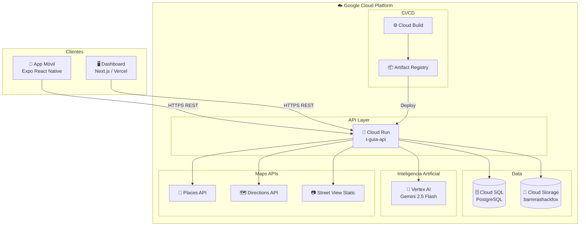

# T-guIA — Navegación Accesible con IA

**HackFox 2026 · Movilidad Inclusiva en Tijuana**

T-guIA es una aplicación móvil de navegación accesible para personas con discapacidad motriz en Tijuana. Combina rutas a pie adaptadas, análisis de accesibilidad con visión artificial, reporte comunitario de barreras y un asistente conversacional con voz — todo respaldado por una API en Google Cloud y un dashboard de monitoreo en tiempo real.

---

## Índice

- [Problema que resuelve](#problema-que-resuelve)
- [Demo en vivo](#demo-en-vivo)
- [Arquitectura del sistema](#arquitectura-del-sistema)
- [Funcionalidades principales](#funcionalidades-principales)
- [Stack tecnológico](#stack-tecnológico)
- [Estructura del proyecto](#estructura-del-proyecto)
- [API Backend](#api-backend)
- [Servicios internos](#servicios-internos)
- [Instalación y configuración](#instalación-y-configuración)
- [Variables de entorno](#variables-de-entorno)
- [Dashboard complementario](#dashboard-complementario)

---

## Problema que resuelve

Las personas con discapacidad motriz en Tijuana enfrentan barreras urbanas invisibles para los mapas convencionales: banquetas rotas, rampas faltantes, obras intempestivas y entradas inaccesibles. Google Maps no distingue entre una ruta a pie estándar y una ruta accesible en silla de ruedas.

T-guIA ataca esto en tres frentes:

1. **Rutas que evitan barreras** — integra un mapa comunitario de obstáculos que se excluyen dinámicamente del cálculo de ruta.
2. **Análisis de accesibilidad del destino** — antes de llegar, Gemini analiza imágenes de Street View para calificar rampas, escalones, banqueta y entrada.
3. **Reporte con IA** — cuando el usuario desvía su ruta, puede fotografiar el obstáculo y Gemini lo clasifica automáticamente (tipo, severidad, descripción).

---

## Demo en vivo

| Plataforma | URL |
|---|---|
| App móvil (Expo Go) | Escanear QR en `npm run start` |
| Dashboard web | [tguia-dashboard.vercel.app](https://tguia-dashboard.vercel.app/) |
| API Backend | `https://t-guia-api-707178617216.us-central1.run.app` |
| Código del dashboard | [github.com/JpAboytes/tguia-dashboard](https://github.com/JpAboytes/tguia-dashboard) |

---

## Arquitectura del sistema



### Flujo de datos detallado

```
┌─────────────────────────────────────────────────────────────────┐
│                        App Móvil (Expo)                         │
│                                                                 │
│  ┌──────────┐   ┌──────────────┐   ┌──────────────────────┐   │
│  │ MapScreen│   │ChatbotScreen │   │ Análisis Accesibilidad│   │
│  └────┬─────┘   └──────┬───────┘   └──────────┬───────────┘   │
│       │                │                        │               │
│  ┌────▼─────────────────▼────────────────────────▼──────────┐  │
│  │              Capa de Servicios (services/)                │  │
│  │  openRouteService · placesSearch · geminiClient          │  │
│  │  routeAvoidances · imageDescription · voiceDetector      │  │
│  └────┬─────────────────────────────────────────────────────┘  │
└───────┼─────────────────────────────────────────────────────────┘
        │ HTTPS
        ▼
┌──────────────────────────────────────────────────────────────────┐
│              Cloud Run — t-guia-api (Python/FastAPI)             │
│                                                                  │
│  POST /clasificar-barrera  →  Vertex AI (foto base64)           │
│  POST /analizar-destino    →  Street View + Vertex AI           │
│  POST /detectar-destino    →  Gemini audio transcription        │
│  GET|POST|DELETE /barreras →  Cloud SQL PostgreSQL              │
│  POST /sesiones            →  Cloud SQL PostgreSQL              │
│                                                                  │
│  Fotos de barreras →  Cloud Storage (barrerashackfox)           │
└──────────────────────────────────────────────────────────────────┘
        │
        ├── Cloud SQL (PostgreSQL)  — barreras, sesiones
        ├── Cloud Storage           — fotos de obstáculos
        └── Vertex AI               — Gemini 2.5 Flash (análisis multimodal)
```

---

## Funcionalidades principales

### 1. Mapa accesible con rutas adaptadas

- Muestra puntos accesibles precargados (rampas, baños, zonas seguras) y barreras reportadas por la comunidad.
- Calcula rutas a pie con **OpenRouteService** usando el perfil `foot-walking`.
- Las barreras activas se convierten en polígonos de exclusión (`avoid_polygons`) que ORS rodea automáticamente.
- Muestra distancia y tiempo estimado a pie al seleccionar un destino.

### 2. Análisis de accesibilidad del destino

Al seleccionar cualquier destino, T-guIA consulta al backend que:

1. Descarga imágenes de Street View del entorno (radio ~50 m).
2. Las envía a **Vertex AI Gemini 2.5 Flash** con un prompt estructurado.
3. Devuelve un puntaje de accesibilidad y detalles sobre: rampa, escalones, estacionamiento accesible, estado de la banqueta, entrada ancha y obstáculos.

El usuario ve una advertencia si el destino es poco accesible, con opción de continuar o cancelar.

```
Resultado de ejemplo:
{
  "accesible": false,
  "puntaje": 3,
  "puntaje_max": 6,
  "detalles": {
    "rampa": false,
    "escalones": true,
    "banqueta_estado": "deteriorada",
    "entrada_ancha": false
  },
  "recomendacion": "Se detectaron escalones sin rampa alternativa visible..."
}
```

### 3. Reporte de barreras con foto + IA

Cuando el usuario presiona **Reajustar ruta**:

1. Se ofrece tomar una foto del obstáculo.
2. La foto (base64) se envía al endpoint `/clasificar-barrera` del backend.
3. **Gemini 2.5 Flash** la analiza y devuelve `tipo`, `severidad` (1–3) y `descripcion`.
4. El usuario confirma o edita la descripción antes de guardar.
5. La barrera se persiste en Cloud SQL y aparece en el mapa de todos los usuarios en tiempo real.

```
Severidades:
  🟡 1 — Leve     (obstáculo menor)
  🟠 2 — Moderada (dificulta el paso)
  🔴 3 — Grave    (bloqueo total)
```

### 4. T-bot — Asistente conversacional

Chatbot con:
- **Entrada de texto** y **entrada de voz** (graba audio → backend transcribe con Gemini).
- Detección de intención de destino: si el usuario dice "llévame a la farmacia", busca en Google Places y navega directamente.
- Respuestas generadas por **Gemini 2.5 Flash** con system prompt enfocado en movilidad accesible en Tijuana.
- Fallback local si la API key no está configurada.

### 5. Guía de voz durante la navegación

- Síntesis de voz con **expo-speech** para instrucciones de giro.
- Rastreo GPS en segundo plano con `expo-task-manager` (actualización cada 5 m o 3 s).
- Botón de mute/unmute en el mapa.

### 6. Validación comunitaria de puntos accesibles

Los puntos precargados (rampas, baños, zonas seguras) pueden ser marcados como "ya no disponibles" por cualquier usuario. El punto se elimina del mapa hasta que sea re-verificado.

---

## Stack tecnológico

| Capa | Tecnología |
|---|---|
| App móvil | React Native 0.81 + Expo 54 + Expo Router 6 |
| Mapas | react-native-maps (Google Maps SDK) |
| Rutas a pie | OpenRouteService v2 (`foot-walking`) |
| Búsqueda de lugares | Google Places API (New) — Text Search |
| IA en cliente | Gemini 2.5 Flash (chat, fallback multimodal) |
| IA en servidor | Vertex AI Gemini 2.5 Flash (foto/audio/Street View) |
| Backend API | Cloud Run — Python FastAPI |
| Base de datos | Cloud SQL PostgreSQL |
| Almacenamiento | Cloud Storage (`barrerashackfox`) |
| CI/CD | Cloud Build + Artifact Registry |
| Dashboard | Next.js en Vercel |
| Voz / Audio | expo-speech + expo-audio |
| GPS background | expo-location + expo-task-manager |

---

## Estructura del proyecto

```
app/
  (tabs)/
    chatbot.tsx          Ruta → ChatbotScreen
    index.tsx            Ruta raíz → MapScreen

components/
  MapScreen.tsx          Pantalla principal: mapa, rutas, barreras, búsqueda
  ChatbotScreen.tsx      Chat con T-bot + entrada de voz
  AccessibilityWarningModal.tsx   Alerta de destino poco accesible
  AccessibilityPromptModal.tsx    Confirmación antes de analizar accesibilidad
  ReroutePromptModal.tsx          Diálogo al rerutear (foto o sin reporte)
  ManualReportModal.tsx           Editor de descripción de barrera
  PlaceValidationModal.tsx        Validación comunitaria de punto accesible
  BarrierDeleteModal.tsx          Eliminación de barrera
  voizToggle.tsx                  Botón de voz

constants/
  accessiblePoints.ts    Puntos accesibles hardcodeados (Tijuana)
  map.ts                 Región por defecto, centro de Tijuana
  keyboard.ts            Constantes de teclado

services/
  placesSearch.ts        Búsqueda híbrida: puntos locales + Google Places API
  openRouteService.ts    Rutas a pie con ORS + avoid_polygons dinámicos
  routeAvoidances.ts     CRUD de barreras contra el backend
  accessibilityAnalysis.ts  POST /analizar-destino → puntaje accesibilidad
  imageDescription.ts    POST /clasificar-barrera → clasificación de foto
  voiceDetector.ts       POST /detectar-destino → transcripción de audio
  sesiones.ts            POST /sesiones → log de sesión de ruteo
  geminiClient.ts        Cliente Gemini con retry, fallback de modelos, logs
  locationTracking.service.ts  GPS en segundo plano (TaskManager)
  geofencing.service.ts  Geofencing (llegada al destino)
  speech.service.ts      Síntesis de voz para guía de navegación

hooks/
  useNavegacion.ts       Estado de navegación activa
  useVoizNavigation.ts   Toggle de voz + síntesis de instrucciones
  useKeyboardInset.ts    Inset del teclado para la UI del chat

utils/
  coordinates.ts         Parse de EXPO_PUBLIC_MAP_CENTER
```

---

## API Backend

Base URL: `https://t-guia-api-707178617216.us-central1.run.app`

### Barreras

| Método | Endpoint | Descripción |
|---|---|---|
| `GET` | `/barreras` | Lista todas las barreras activas |
| `POST` | `/barreras` | Crea una nueva barrera |
| `DELETE` | `/barreras/:id` | Desactiva una barrera por ID |

**Body POST /barreras:**
```json
{
  "lat": 32.5149,
  "lng": -117.0382,
  "tipo": "escalon",
  "severidad": 2,
  "descripcion": "Escalón de 15 cm sin rampa",
  "foto_url": "https://storage.googleapis.com/barrerashackfox/...",
  "calle_aprox": "Av. Revolución y Calle 3"
}
```

### IA — Clasificación de barrera

| Método | Endpoint | Descripción |
|---|---|---|
| `POST` | `/clasificar-barrera` | Analiza una foto de obstáculo con Gemini |

**Body:**
```json
{
  "foto_base64": "<base64 de la imagen>",
  "mime_type": "image/jpeg"
}
```

**Respuesta:**
```json
{
  "tipo": "banqueta_rota",
  "severidad": 2,
  "descripcion": "Banqueta con hundimiento de aproximadamente 20 cm..."
}
```

### IA — Análisis de accesibilidad de destino

| Método | Endpoint | Descripción |
|---|---|---|
| `POST` | `/analizar-destino` | Analiza accesibilidad con Street View + Gemini |

**Body:**
```json
{
  "lat": 32.5149,
  "lng": -117.0382,
  "nombre_lugar": "Hospital General de Tijuana",
  "idioma": "es"
}
```

**Respuesta:**
```json
{
  "lugar": "Hospital General de Tijuana",
  "fotos_analizadas": 4,
  "accesible": true,
  "puntaje": 5,
  "puntaje_max": 6,
  "detalles": {
    "rampa": true,
    "escalones": false,
    "estacionamiento_accesible": true,
    "banqueta_estado": "buena",
    "entrada_ancha": true,
    "obstaculos": false
  },
  "resumen": "El destino cuenta con rampa de acceso visible...",
  "recomendacion": "Acceso principal recomendado por la entrada sur."
}
```

### IA — Detección de destino por voz

| Método | Endpoint | Descripción |
|---|---|---|
| `POST` | `/detectar-destino` | Transcribe audio y extrae el destino mencionado |

**Body:**
```json
{
  "audio_base64": "<base64 del audio>",
  "mime_type": "audio/mp4"
}
```

**Respuesta:**
```json
{
  "lugarDestino": "Hospital General",
  "idioma": "es",
  "transcripcion": "llévame al Hospital General",
  "confianza": "alta"
}
```

### Sesiones de ruteo

| Método | Endpoint | Descripción |
|---|---|---|
| `POST` | `/sesiones` | Registra una sesión de ruteo (analytics) |

---

## Servicios internos

### `geminiClient.ts`

Cliente robusto para la API de Gemini con:
- **Lista dinámica de modelos** — consulta `/v1beta/models` al inicio y usa los disponibles.
- **Prioridad de modelos:** `gemini-2.5-flash` → `gemini-2.5-flash-lite` → `gemini-2.5-pro` → ...
- **Doble estrategia de auth:** header `x-goog-api-key` primero; si falla 401/403, reintenta con `?key=` en la URL (compatible con keys tipo `AQ.`).
- **Logs seguros:** ofusca la API key y trunca el base64 en los logs de desarrollo.

### `openRouteService.ts`

Calcula rutas a pie integrando barreras:
1. Consulta `/barreras` para obtener obstáculos activos.
2. Convierte cada barrera en un polígono cuadrado de ~33 m (`avoid_polygons`).
3. Envía el `MultiPolygon` a ORS `/v2/directions/foot-walking/geojson`.
4. Devuelve coordenadas GeoJSON, distancia y duración.

### `placesSearch.ts`

Búsqueda híbrida en dos capas:
1. **Local** — filtra `ACCESSIBLE_POINTS` por nombre/descripción.
2. **Google Places** (New Text Search API) — con bias geográfico hacia el usuario (12 km) o Tijuana (40 km fallback).
3. Deduplica por coordenada, ordena por distancia y devuelve los 12 primeros.

---

## Instalación y configuración

```bash
# 1. Clonar el repositorio
git clone <repo-url>
cd hackfox2026

# 2. Instalar dependencias
npm install

# 3. Configurar variables de entorno
cp .env.example .env
# Editar .env con tus keys (ver sección siguiente)

# 4. Iniciar el servidor de desarrollo
npm run start

# 5. En Google Cloud Console, habilitar:
#    - Places API (New)
#    - Maps SDK for Android / iOS (si se va a compilar nativo)

# 6. Escanear el QR con Expo Go (iOS/Android)
```

Para Android:
```bash
npm run android
```

Para iOS:
```bash
npm run ios
```

---

## Variables de entorno

```env
# Centro inicial del mapa (lat,lng) — Tijuana por defecto
EXPO_PUBLIC_MAP_CENTER=32.5149,-117.0382

# Google Maps — Places API (New) para búsqueda de lugares
# Habilitar en: console.cloud.google.com → Places API (New)
EXPO_PUBLIC_GOOGLE_MAPS_API_KEY=your_google_maps_api_key_here

# OpenRouteService — cálculo de rutas a pie
# Obtener en: openrouteservice.org/dev/
EXPO_PUBLIC_ORS_API_KEY=your_openrouteservice_api_key_here

# Gemini — chat del bot y fallback de descripción de fotos
# Crear en: aistudio.google.com/apikey
EXPO_PUBLIC_GEMINI_API_KEY=your_gemini_api_key_here
```

> **Nota:** El análisis de accesibilidad con Street View y la clasificación de fotos de barreras se ejecutan en el backend de Cloud Run y **no requieren** configuración adicional en el cliente.

---

## Dashboard complementario

El dashboard en [tguia-dashboard.vercel.app](https://tguia-dashboard.vercel.app/) muestra en tiempo real la actividad generada por la app:

- Mapa de calor de barreras reportadas con filtros por tipo y severidad.
- Historial de sesiones de ruteo (origen → destino, distancia, barreras evitadas).
- Estadísticas de uso del análisis de accesibilidad.
- Gestión de barreras: activar/desactivar obstáculos reportados.

Código fuente: [github.com/JpAboytes/tguia-dashboard](https://github.com/JpAboytes/tguia-dashboard)

---

## Equipo

HackFox 2026 — CETYS Universidad Tijuana
